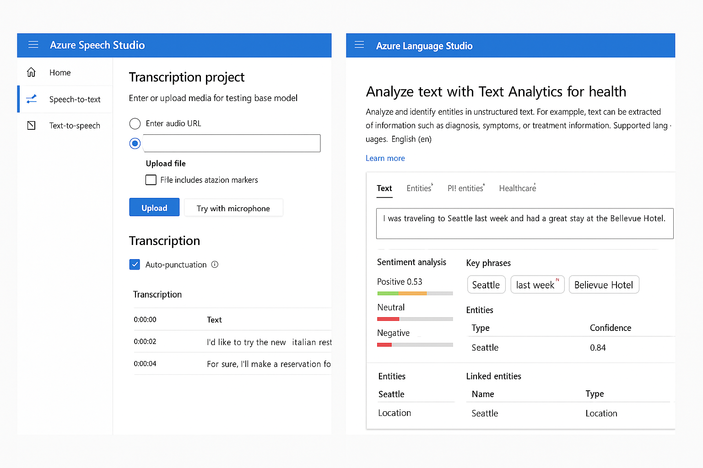
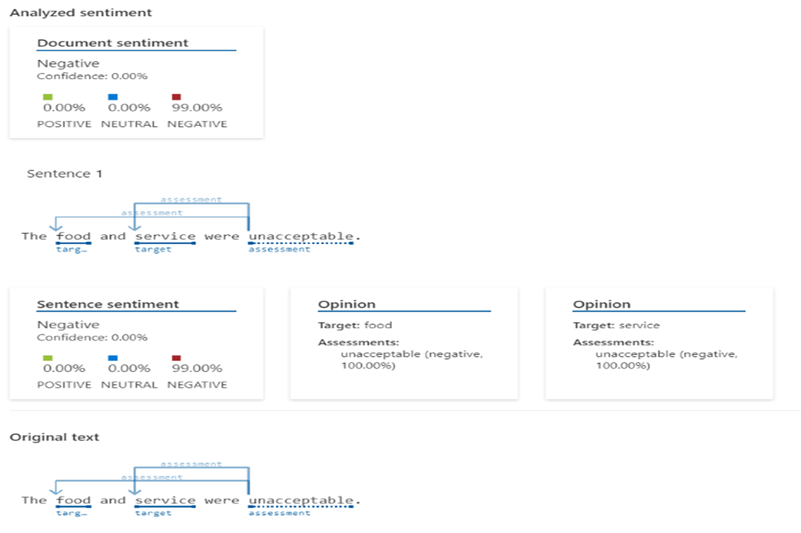

# 💡 Desafio DIO: Azure Speech Studio & Language Studio

Este repositório documenta a realização prática do laboratório proposto pela DIO com foco em Inteligência Artificial aplicada à **fala** e à **linguagem natural**, utilizando as ferramentas da Microsoft: **Azure Speech Studio** e **Language Studio**.

---

## 🎯 Objetivo do Projeto

- Aplicar na prática os conhecimentos adquiridos sobre IA de voz e linguagem.
- Utilizar as ferramentas Azure Speech Studio e Language Studio para experimentar recursos de transcrição, análise de sentimento, extração de entidades e síntese de fala.
- Documentar todo o processo de forma clara e organizada.
- Compartilhar aprendizados e reflexões pessoais como material de apoio futuro.

---

## 🛠️ Ferramentas Utilizadas

- [Azure Speech Studio](https://speech.microsoft.com/)
- [Azure Language Studio](https://language.cognitive.azure.com/)
- [GitHub](https://github.com/)
- Markdown para documentação

---

## 🔍 O que foi feito

### 📌 Speech Studio

- ✅ Criação de projeto de transcrição de áudio (Speech-to-Text).
- ✅ Teste com entrada de áudio personalizada.
- ✅ Visualização do resultado com timestamps e pontuação automática.
- ✅ Avaliação da acurácia da transcrição.

### 📌 Language Studio

- ✅ Análise de sentimento em diferentes trechos de texto.
- ✅ Extração de entidades nomeadas (NER - Named Entity Recognition).
- ✅ Classificação automática de texto por tópico e intenção.

---

## ✍️ Anotações e Insights

Durante a prática, observei os seguintes pontos relevantes:

- As ferramentas da Microsoft são bastante acessíveis e intuitivas, com fluxos guiados e resultados visuais rápidos.
- O Speech Studio consegue lidar bem com variações de sotaques e ruídos moderados de fundo.
- A análise de sentimento foi precisa, especialmente para textos objetivos e curtos.
- A extração de entidades foi eficiente ao identificar nomes, datas e localizações, o que pode ser útil em sistemas de atendimento ou organização de documentos.
- O Language Studio facilita o teste de modelos sem necessidade de codificação, ideal para profissionais não técnicos.
- A combinação dessas duas ferramentas permite criar soluções completas, como assistentes virtuais, transcrição automática de reuniões e análise de feedback de clientes.

---

## 📸 Capturas de Tela

Imagens reais do uso das ferramentas foram adicionadas na pasta `/images`:

| Speech Studio | Language Studio |
|---------------|-----------------|
|  |  |

---

## 📚 Referências

- [Explore Speech Studio - Microsoft Learn](https://microsoftlearning.github.io/mslearn-ai-fundamentals/Instructions/Labs/09-speech.html)
- [Analyze Text with Language Studio - Microsoft Learn](https://microsoftlearning.github.io/mslearn-ai-fundamentals/Instructions/Labs/06-text-analysis.html)
- [GitHub Markdown Guide](https://www.markdownguide.org/basic-syntax/)

---

## ✅ Conclusão

Este projeto reforçou a importância da inteligência artificial no processamento de linguagem e voz. Utilizar as ferramentas da Azure de forma prática foi essencial para visualizar possibilidades reais de aplicação, seja no atendimento ao cliente, acessibilidade, ou análise de dados. A experiência foi rica e aplicável, consolidando os conhecimentos vistos ao longo da formação.

---

🚀 *Projeto realizado como parte da trilha da DIO sobre IA com ferramentas Microsoft.*
